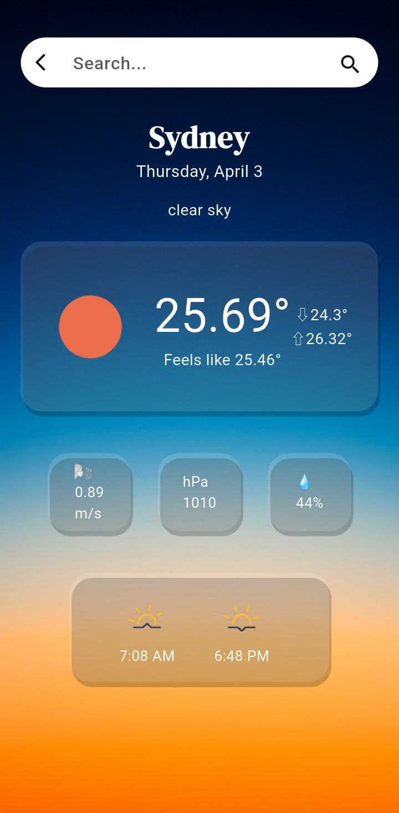
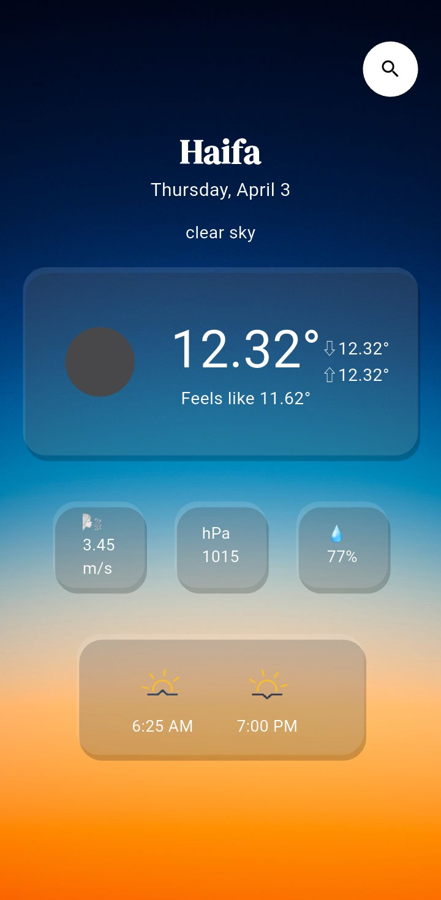

# Current Weather Forecast

This application for viewing the current weather forecast in any city worldwide.

## Features

- Search – Enter a city name to check the weather.  
- Temperature – Displays the current, minimum, maximum, and feels-like temperature.  
- Additional Parameters – Wind speed, pressure, and humidity.  
- Sunrise and Sunset – Shows the sunrise and sunset times.  
- Geolocation – Automatically detects the user's location.

### Packages Used
    
- geolocator – Retrieves the user's location  
- geocoding – Converts coordinates into city names  
- anim_search_bar – Animated search bar  
- timezone – Handles time zones  
- intl – Localization and data formatting  
- native_device_orientation – Detects device orientation  
- flutter_localization – Supports multilingual interfaces  

### Based on a Learning Example  

This application was initially created based on an educational example, with additional features and improvements added.  

### Preview  

  
  

